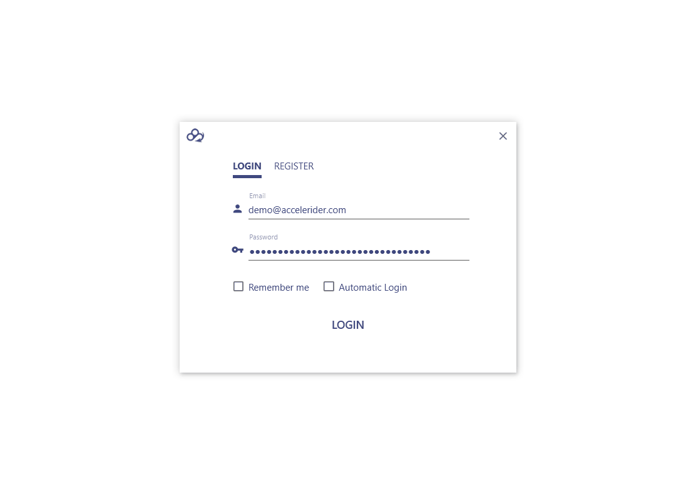

# AcceleRider for Windows    

---

## Roadmap

经过了一年的（~~拖更~~）策划，我们决定对原项目进行一系列的重大更新，具体的（~~坑~~）计划如下：

1. **RESTful API**：重新设计并实现一套 RESTful 风格的 API，见：[Accelerider RESTful API](http://naotu.baidu.com/file/061af743a715490f9e2842a80dc531ab?token=c1b3eaf86dcecf57)。
1. **组件化**：加入应用商店功能，将原项目的网盘服务作为一个应用组件，同时我们在今后也将提供更多的黑科技功能，用户可以在商店中自主安装、卸载相应的应用组件。目前在计划中的应用组件如下：

      | App                          | Description                                                                               |
      | ---------------------------- | ----------------------------------------------------------------------------------------- |
      | Net Disk（开发中）           | 原项目的网盘服务，提供（~~不解释的~~）很普通的网盘文件管理功能。                          |
      | Group（开发中）              | 一个网盘文件共享社区，类似 X 度网盘的群组功能。                                           |
      | Scrapy Incubator（尚未开始） | 用于部署 [Scrapy](https://github.com/scrapy/scrapy) 的`.egg`文件，提供 GUI 及分布式功能。 |

1. **更新软件UI**：新一版的界面设计（~~像素级~~）充分借鉴了微软的[Teams](https://products.office.com/en-us/microsoft-teams/group-chat-software)产品，因为我们缺乏美工、UI/UX设计师，正如某位领袖所说：

    

    P.S.: 如果你对我的这种借鉴行为感到非常不满，并且你刚好是一位美工或UI/UX设计师，我希望你能加入并帮助我们改善产品设计（当然纯凭业余兴趣）。重写UI虽然麻烦，但也不是什么难事。

## Contributing

如果您对此项目有兴趣，或者您想将自己的作品整合进本项目的应用商店，欢迎通过以下方式参与：

* 加入我们：（非程~~序员~~勿扰）

     1. 开发者群：`UVE6IDYyMjgxMTg3NCB8IHBhc3N3b3JkOiAxMzc5`
     1. 联系作者：`UVE6IDE4NDQ4MTIwNjc=` - [Mrs4s](https://github.com/Mrs4s)、`UVE6IDc4NzY3MzM5NQ==` - [ZDP](https://github.com/DingpingZhang)

* 在 [Issues](https://github.com/Accelerider/Accelerider.Windows/issues) / [Gitter](https://gitter.im/Accelerider/Accelerider.Windows) 留言，分享你的建议或需求；
* Fork 此项目，并通过 [Pull requests](https://github.com/Accelerider/Accelerider.Windows/pulls) 贡献你的代码。

## Screenshots

## Dependencies

* [MaterialDesignInXamlToolkit](https://github.com/ButchersBoy/MaterialDesignInXamlToolkit)
* [Unity Container](https://github.com/unitycontainer/unity)
* [Prism](https://github.com/PrismLibrary/Prism)
* [refit](https://github.com/paulcbetts/refit)
* [Newtonsoft.Json](https://www.newtonsoft.com/json)
